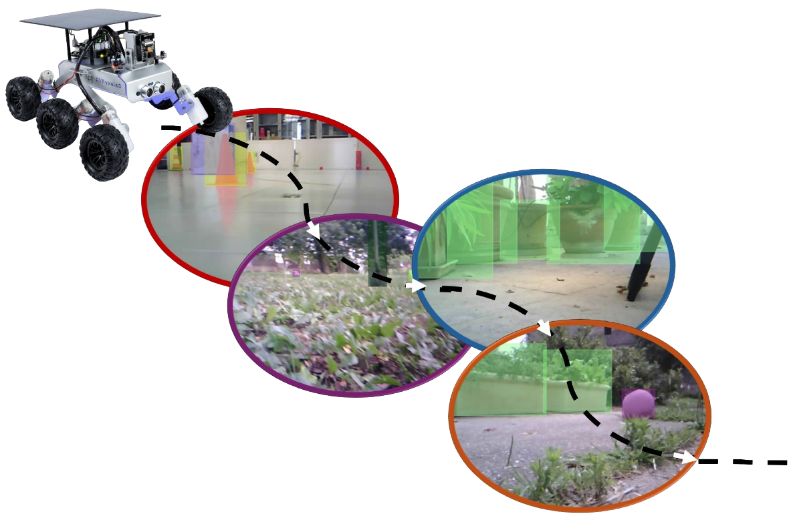
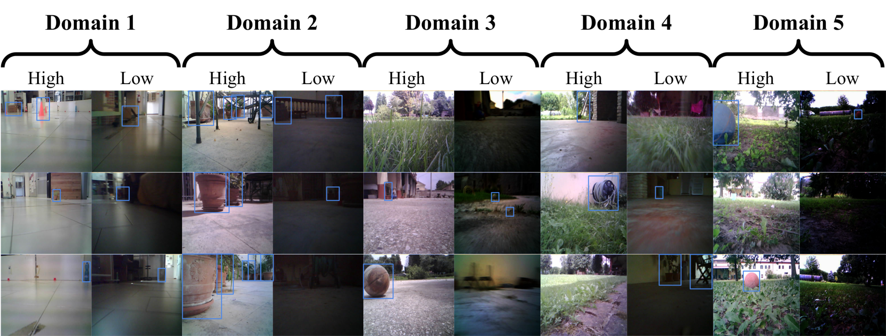
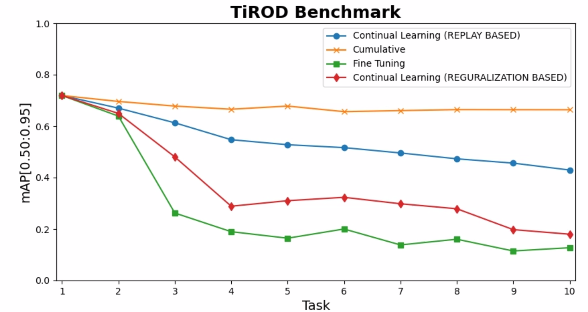

<div align="center">



# TiROD: Tiny Robotics Object Detection Dataset and Benchmark
**A dataset designed to benchmark Continual Object Detection in Tiny Robotics applications**

</div>

* 🗺 **Multiple Domains**: 5 fifferent domains indoor and outdoor, multiple illumination conditions 
* 🤖 **Tiny Robotics**: Data collected with a real Tiny Robotic platform, equipped with ESP32-CAM
* 🌐 **Official Website**: Official website of the Dataset at this [link](https://pastifra.github.io/TiROD/)

****

## Introduction
<div align="center">

</div>

This README reports implementations details of the TiROD dataset and benchmark to replicate the results of our [paper](#citation).

## Dataset

TiROD is a benchmark designed to evaluate the performance of Continual Learning (CL) algorithms for Object Detection, using data collected by a small robotic rover.

The dataset defines 10 distinct CL tasks, which are determined by the rover's exploration of 5 unique environments under two lighting conditions: high and low illumination. These tasks are labeled from d1_h (Domain 1, High illumination) to d5_l (Domain 5, Low illumination). The first two tasks take place in indoor settings, while the remaining tasks occur outdoors, where the terrain becomes increasingly rugged.

For more details, please refer to our [paper](#citation)

Please download the dataset and the annotations from [here]()

Data is structured as follows:
```
TiROD
├── Domain1
│   ├── High
│   │   ├── annotations
│   │   │   ├── train.json
│   │   │   ├── val.json
│   │   │   ├── test.json
│   │   ├── images
│   │   │   ├── train
│   │   │   │   ├── frame1.png
│   │   │   │   ├── ...
│   │   │   ├── val
│   │   │   │   ├── ...
│   │   │   ├── test
│   │   │   │   ├── ...
│   ├── Low
│   │   ├── ...
├── ...
└── docs
    └── README.md
```

## Results
<div align="center">
  
</div>

We benhmarked both regularization based CL apporaches and replay based CL approaches.

The figure in the left depicts the overall mAP performances in the series of 10 CL tasks defined by TiROD.

****
# CL benchmark

## Install Nanodet
As our work is based on the Nanodet detector, you need to first install it in an environment. 
To do so, refer to [nanodetDocs/README.md](nanodetDocs/README.md)

## Setup Config file

Before training you need to setup the training cfg file!

To do so:

* Open [cfg/TiROD.yml](eclod/cfg/TiROD.yml)

* Edit img_path and ann_path of train and val data to the path of your train and test datasets

* If you want, you can change in schedule the epochs, val intervals as well as optimizer and learning rates 

To replicate the results of our paper, just change the img and ann path to the folders where you downloaded your data.

You can also change the Nanodet architecture by taking inspiration from other configs.
To do so please refer to [nanodetDocs/README.md](nanodetDocs/README.md) and update the cfg file based on your needs.

You can test the TiROD benchmark with the CL method reported in our [paper](#citation) (from eclod folder and with the created environment):

**Fine-Tuning**

```python TiROD.py --TiROD_task <choose a name> --cfg cfg/TiROD.yml --gpu <the GPU ID>```

**Cumulative Training**

```python TiROD_CUMUL.py --TiROD_task <choose a name> --cfg cfg/TiROD.yml --gpu <the GPU ID>```

**Replay**

```python TiROD_REP.py --TiROD_task <choose a name> --cfg cfg/TiROD.yml --gpu <the GPU ID>```

**Temporal Replay**

```python TiROD_TREP.py --TiROD_task <choose a name> --cfg cfg/TiROD.yml --gpu <the GPU ID>```

**KMeans Replay**

```python TiROD_KMREP.py --TiROD_task <choose a name> --cfg cfg/TiROD.yml --gpu <the GPU ID>```

**Latent Replay**

```python TiROD_REP.py --TiROD_task <choose a name> --cfg cfg/TiROD.yml --gpu <the GPU ID>```

**LwF**

```python TiROD_LwF.py --TiROD_task <choose a name> --cfg cfg/TiROD.yml --gpu <the GPU ID>```

**EwC**

```python TiROD_EwC.py --TiROD_task <choose a name> --cfg cfg/TiROD.yml --gpu <the GPU ID>```

**SID Distillation**

```python TiROD_SID.py --TiROD_task <choose a name> --cfg cfg/TiROD.yml --gpu <the GPU ID>```

**Latent Distillation**

```python TiROD_LD.py --TiROD_task <choose a name> --cfg cfg/TiROD.yml --gpu <the GPU ID>```

****

## Citation

If you find this project useful in your research, please add a star and cite us 😊 

```BibTeX
@misc{pasti2024TiROD,
    title={Tiny Robotics Dataset and Benchmark for Continual Object Detection},
    author={Francesco Pasti, Riccardo De Monte, Davide Dalle Pezze, Gian Antonio Susto, Nicola Bellotto},
    year={2024}
}
```

****

## Related works

```BibTeX
@inproceedings{pastiLD,
  title={Latent Distillation for Continual Object Detection at the edge.},
  author={Pasti, Francesco and Ceccon, Marina and Dalle Pezze, Davide and Paissan, Francesco and Farella, Elisabetta and Susto, Gian Antonio and Bellotto, Nicola},
  booktitle={European conference on computer vision},
  year={2024},
}
```
https://github.com/pastifra/Continual_Nanodet

## Thanks

https://github.com/RangiLyu/nanodet
